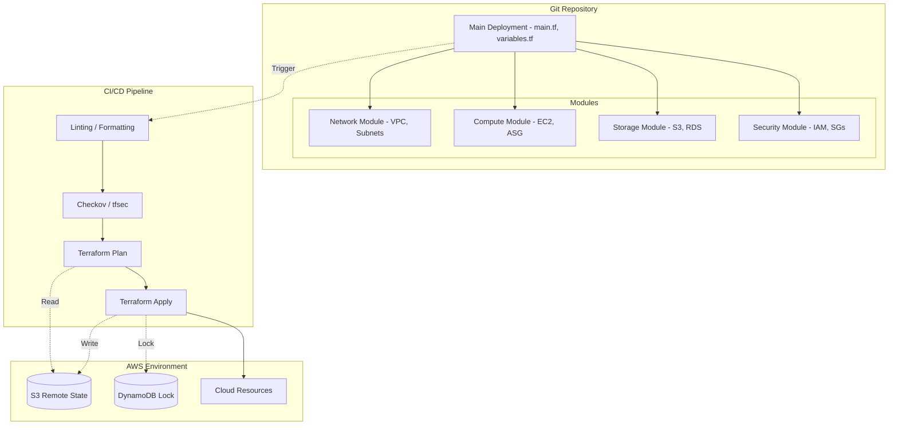

# Infrastructure as Code (IaC) Security Architecture

## 1. Introduction
As organizations migrate to cloud-native infrastructures, managing resources through Infrastructure as Code (IaC) has become the standard. This architecture design document outlines a secure IaC pipeline utilizing Terraform for infrastructure provisioning and Ansible for configuration management. The primary focus is on establishing strict security controls across the deployment lifecycle, addressing secrets management, state file security, drift detection, and automated compliance validation.

## 2. Core Tools and Division of Responsibilities
*   **Terraform:** Responsible for the declarative provisioning of immutable cloud resources (AWS VPC, Subnets, EC2 instances, S3 buckets, Security Groups, IAM Roles).
*   **Ansible:** Responsible for the imperative configuration of provisioned instances (OS hardening, package management, service configuration, and application deployment).

## 3. Security Architecture Components

### 3.1. Secrets Management
Hardcoding secrets (API keys, database passwords, TLS certificates) in IaC repositories is a critical vulnerability.
*   **Implementation:** All secrets are externalized using a centralized secrets manager (e.g., AWS Secrets Manager or HashiCorp Vault). 
*   Terraform dynamically fetches secrets during execution using data sources rather than reading them from `tfvars` files committed to version control.
*   Ansible fetches runtime secrets using lookups (e.g., `hashi_vault` or `aws_ssm` plugins), ensuring they are never written to disk or exposed in playbooks.

### 3.2. State File Security (Terraform)
The Terraform state file (`terraform.tfstate`) maps real-world resources to the configuration and often contains sensitive data in plain text (e.g., RDS initial passwords).
*   **Remote Backend:** State files are never stored locally. They are pushed to a remote backend (AWS S3).
*   **Encryption at Rest:** The S3 bucket is configured with server-side encryption (SSE-KMS) to protect the state file at rest.
*   **State Locking:** A DynamoDB table is used to implement state locking, preventing race conditions and state corruption when multiple pipelines run concurrently.
*   **Versioning:** S3 bucket versioning is enabled to allow recovery from accidental state deletion or corruption.

### 3.3. Policy Enforcement (Shift-Left Security)
Before any code is deployed, it must pass security checks.
*   **Static Analysis:** Tools like Checkov or tfsec are integrated into the CI/CD pipeline to scan Terraform code for misconfigurations (e.g., open security groups, unencrypted S3 buckets) and block the deployment if critical policies are violated.
*   **Ansible Linting:** Ansible-lint is used to enforce best practices and security rules in playbooks.

### 3.4. Drift Detection and Remediation
Infrastructure drift occurs when the actual state of the cloud environment diverges from the code (e.g., an administrator manually opens a port in the AWS console).
*   **Detection:** A scheduled CI/CD pipeline runs `terraform plan` periodically. If the plan shows pending changes (indicating drift), an alert is sent to the security team.
*   **Remediation:** For critical environments, a continuous reconciliation loop can be implemented to automatically run `terraform apply` and overwrite manual changes, enforcing the code as the single source of truth.

### 3.5. Rollback Procedures
*   Because Terraform state is versioned in S3 and code is versioned in Git, rollbacks are performed by reverting the Git commit to the last known good state and running the pipeline.
*   Data resources (like databases) have snapshot lifecycle hooks configured in Terraform to ensure data is not lost during a destructive rollback.

## 4. Terraform Module Structure Diagram

## 5. Ansible Compliance Validation
Once Terraform provisions the infrastructure, Ansible connects via SSH to configure the OS.
*   **Hardening Roles:** Ansible runs roles based on CIS (Center for Internet Security) benchmarks (e.g., disabling root login, configuring auditd, setting up ufw/iptables, and installing fail2ban).
*   **Idempotency:** Playbooks are designed to be idempotent; they can be run repeatedly without causing unintended changes, which is crucial for continuous compliance enforcement.
*   **Reporting:** The final step of the Ansible run involves generating a compliance report, verifying that all expected hardening controls are active.

## 6. Conclusion
By decoupling provisioning (Terraform) and configuration (Ansible), and wrapping both in a CI/CD pipeline with strict static analysis, encrypted remote state management, and externalized secrets, this architecture ensures that cloud infrastructure is not only deployed rapidly but remains intrinsically secure and compliant with enterprise standards.
